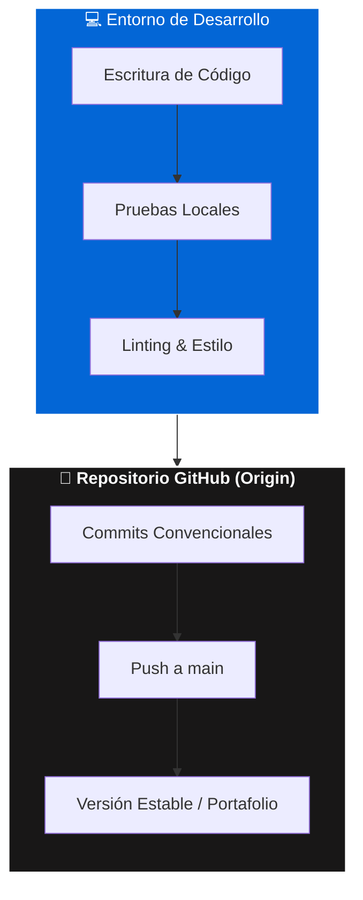

# Arquitectura y Flujo de Trabajo: IP-Tracker

Este diagrama ilustra el flujo de desarrollo y despliegue estandarizado en GitHub, enfocado en la transparencia y colaboración.

```mermaid
flowchart TD
    %% Definición de Estilos
    classDef github fill:#181717,stroke:#fff,stroke-width:2px,color:#fff,font-weight:bold;
    classDef dev fill:#0366d6,stroke:#fff,stroke-width:1px,color:#fff;

    subgraph Desarrollo ["💻 Entorno de Desarrollo"]
        direction TB
        Code[Escritura de Código] --> TestLocal[Pruebas Locales]
        TestLocal --> Lint[Linting & Estilo]
    end

    subgraph GitHub_Repo ["🐙 Repositorio GitHub (Origin)"]
        direction TB
        Commit[Commits Convencionales] --> Push[Push a main]
        Push --> Release[Versión Estable / Portafolio]
    end

    %% Relaciones
    Desarrollo --> GitHub_Repo

    %% Asignación de clases
    Desarrollo:::dev
    GitHub_Repo:::github
```

